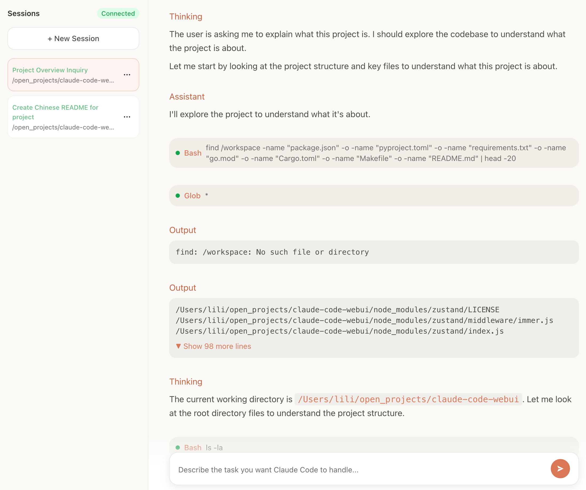

[简体中文](README_ZH.md) 

# Claude Code WebUI

**Claude Code — now in your browser. Anywhere.**

A **web-based Claude Code** that runs on **desktop, mobile phones, and iPads**,  
while **sharing the exact same configuration as your local Claude Code**.

> No cloud rewrite.  
> No vendor lock-in.  
> Just Claude Code — everywhere.



---

## ✨ Why Claude Code WebUI?

Claude Code is powerful — but it’s **terminal-bound**.

That means:
- ❌ Not usable on mobile or iPad
- ❌ Hard to access remotely
- ❌ Awkward for demos, monitoring, or quick edits

**Claude Code WebUI solves this by:**

- 🌍 Running Claude Code **in your browser**
- 📱 Supporting **mobile & iPad**
- 🔁 Reusing your **existing `~/.claude/settings.json`**
- 🧠 Staying **100% compatible** with local Claude Code

If Claude Code works on your machine —  
**it works here.**

---

## 🚀 Quick Start (10 seconds)

### 1. Prerequisites

Make sure you have **Bun** and **Claude Code** installed.

```bash
# Install Bun
curl -fsSL https://bun.sh/install | bash

# Install Claude Code
npm install -g @anthropic-ai/claude-code
````

---

### 2. Run Claude Code WebUI

```bash
bunx @devagentforge/claude-code-webui@latest
```

Open your browser:

```text
http://localhost:10086
```

✅ That’s it.

---

### Change Port (Optional)

```bash
PORT=3000 bunx @devagentforge/claude-code-webui@latest
```

---

## 🧠 Core Capabilities

### 🤖 Claude Code — in the Browser

* Natural language interaction with Claude Code
* **Real-time streaming output** (word-by-word)
* Markdown + syntax-highlighted code rendering
* Clean, Claude-style UI

---

### 📂 Session & Workspace Management

* Create sessions with **custom working directories**
* Resume any previous conversation
* Full local session history (SQLite-backed)
* Safe deletion & automatic persistence

---

### 🔐 Tool Permission Control

* Explicit approval for tool execution
* Allow / deny per tool
* Bulk permission policies
* Manual handling for AskUserQuestion flows

---

### 📱 Mobile-First UI

* Fully responsive (desktop / phone / iPad)
* Claude-style light theme
* Fast session switching
* Touch-friendly interactions

---

## 🔁 Fully Compatible with Local Claude Code

Claude Code WebUI **does not reinvent configuration**.

It directly reuses:

```text
~/.claude/settings.json
```

Which means:

* Same API keys
* Same base URL
* Same models
* Same behavior

> Configure Claude Code once — use it everywhere.

---

## 🧩 Architecture Overview

### Frontend

* React 19 + TypeScript
* Tailwind CSS 4
* Radix UI
* Zustand
* Markdown + syntax highlighting
* Streaming-first rendering

### Backend

* Bun runtime
* Hono web framework
* WebSocket-based streaming
* SQLite (WAL mode)
* Claude Agent SDK

---

## 🛠 Run from Source

```bash
git clone https://github.com/DevAgentForge/claude-code-webui.git
cd claude-code-webui

bun install
bun run build
bun run start
```

---

## ⚙️ Environment Variables

```bash
PORT=10086
DB_PATH=./webui.db
CORS_ORIGIN=*
```

Claude-related config is shared with Claude Code:

* `ANTHROPIC_AUTH_TOKEN`
* `ANTHROPIC_BASE_URL`
* `ANTHROPIC_MODEL`
* `ANTHROPIC_DEFAULT_SONNET_MODEL`
* `ANTHROPIC_DEFAULT_OPUS_MODEL`
* `ANTHROPIC_DEFAULT_HAIKU_MODEL`
* `API_TIMEOUT_MS`
* `CLAUDE_CODE_DISABLE_NONESSENTIAL_TRAFFIC`

---

## 🗺 Roadmap

Planned features:

* 🌐 Web-based configuration for Base URL & API Key
* 🐙 Use **GitHub repositories as working directories**
* 🧠 Partial replacement of Claude Code Web
* 👥 Multi-session & multi-agent improvements
* 🚧 More coming soon

---

## 🤝 Contributing

PRs are welcome.

1. Fork this repository
2. Create your feature branch
3. Commit your changes
4. Open a Pull Request

---

## ⭐ Final Note

If you’ve ever wanted:

* Claude Code on your phone
* Claude Code on an iPad
* Claude Code without a terminal

This project is for you.

👉 **Star it if it helps you.**