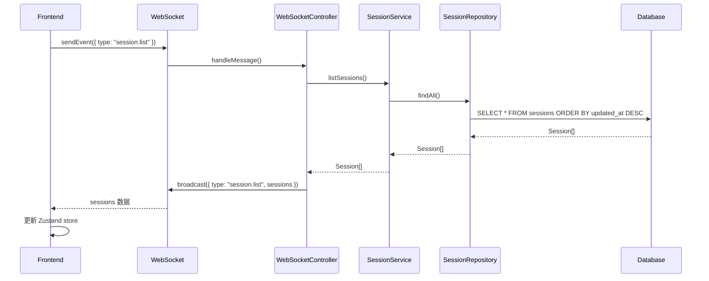
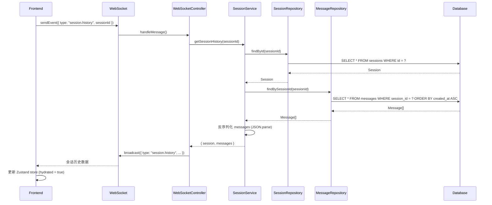

# 后台会话读取架构文档

**创建日期**: 2026-01-11
**最后更新**: 2026-01-11

---

## 📋 目录

1. [概览](#概览)
2. [数据库架构](#数据库架构)
3. [分层架构](#分层架构)
4. [会话读取流程](#会话读取流程)
5. [消息读取流程](#消息读取流程)
6. [完整数据流](#完整数据流)
7. [关键代码位置](#关键代码位置)

---

## 概览

Claude Code WebUI 使用分层架构来管理会话和消息的读取：

```
Frontend (React + Zustand)
    ↓ WebSocket
WebSocket Controller
    ↓ 调用
Session Service
    ↓ 调用
Repository Layer (Session + Message)
    ↓ 查询
Database (SQLite via Drizzle ORM)
```

---

## 数据库架构

### 表结构

#### 1. `sessions` 表

存储会话的元数据。

```typescript
// src/server/db/schema/sessions.schema.ts
export const sessions = sqliteTable("sessions", {
  id: text("id").primaryKey(),                    // 会话唯一标识
  title: text("title").notNull(),                 // 会话标题
  claudeSessionId: text("claude_session_id"),     // Claude SDK 的会话 ID（用于恢复）
  status: text("status").notNull(),               // "idle" | "running" | "completed" | "error"
  cwd: text("cwd"),                               // 工作目录
  allowedTools: text("allowed_tools"),            // 允许的工具（JSON 字符串）
  lastPrompt: text("last_prompt"),                // 最后的用户提示
  createdAt: integer("created_at", { mode: "timestamp" }),
  updatedAt: integer("updated_at", { mode: "timestamp" }),
});
```

#### 2. `messages` 表

存储会话中的所有消息流。

```typescript
// src/server/db/schema/messages.schema.ts
export const messages = sqliteTable("messages", {
  id: text("id").primaryKey(),                    // 消息唯一标识
  sessionId: text("session_id")                   // 外键，关联到 sessions
    .notNull()
    .references(() => sessions.id, {
      onDelete: "cascade"                         // 级联删除
    }),
  data: text("data").notNull(),                   // JSON 序列化的 StreamMessage
  createdAt: integer("created_at", { mode: "timestamp" }),
});
```

#### 3. 关系定义

```typescript
// messages 属于 session
export const messagesRelations = relations(messages, ({ one }) => ({
  session: one(sessions, {
    fields: [messages.sessionId],
    references: [sessions.id],
  }),
}));

// session 有多个 messages
export const sessionsRelations = relations(sessions, ({ many }) => ({
  messages: many(messages),
}));
```

---

## 分层架构

### 1. Repository Layer（数据访问层）

负责直接与数据库交互，提供 CRUD 操作。

#### SessionRepository

位置: `src/server/repositories/session.repository.ts`

**核心方法**:

```typescript
export class SessionRepository extends BaseRepository {
  // 创建会话
  async create(data: InsertSession): Promise<Session>

  // 根据 ID 查找单个会话
  async findById(id: string): Promise<Session | null>

  // 查找所有会话（按更新时间降序）
  async findAll(): Promise<Session[]>

  // 根据状态查找会话
  async findByStatus(status: string): Promise<Session[]>

  // 更新会话
  async update(id: string, data: Partial<InsertSession>): Promise<Session | null>

  // 删除会话
  async delete(id: string): Promise<boolean>

  // 获取最近使用的工作目录
  async getRecentCwds(limit = 8): Promise<string[]>
}
```

**实现示例**:

```typescript
// 查找单个会话
async findById(id: string): Promise<Session | null> {
  try {
    const [session] = await this.db
      .select()
      .from(sessions)
      .where(eq(sessions.id, id))
      .limit(1);
    return session || null;
  } catch (error) {
    this.handleError(error, "find session by id");
  }
}

// 查找所有会话
async findAll(): Promise<Session[]> {
  try {
    return await this.db
      .select()
      .from(sessions)
      .orderBy(desc(sessions.updatedAt));
  } catch (error) {
    this.handleError(error, "find all sessions");
  }
}
```

#### MessageRepository

位置: `src/server/repositories/message.repository.ts`

**核心方法**:

```typescript
export class MessageRepository extends BaseRepository {
  // 创建消息
  async create(data: InsertMessage): Promise<Message>

  // 根据会话 ID 查找所有消息（按创建时间升序）
  async findBySessionId(sessionId: string): Promise<Message[]>

  // 删除会话的所有消息
  async deleteBySessionId(sessionId: string): Promise<number>

  // 批量创建消息
  async batchCreate(data: InsertMessage[]): Promise<Message[]>
}
```

**实现示例**:

```typescript
// 查找会话的所有消息
async findBySessionId(sessionId: string): Promise<Message[]> {
  try {
    return await this.db
      .select()
      .from(messages)
      .where(eq(messages.sessionId, sessionId))
      .orderBy(asc(messages.createdAt));  // 按时间升序
  } catch (error) {
    this.handleError(error, "find messages by session");
  }
}
```

### 2. Service Layer（业务逻辑层）

负责业务逻辑和协调多个 Repository。

#### SessionService

位置: `src/server/services/session.service.ts`

**核心方法**:

```typescript
export class SessionService {
  constructor(
    private sessionRepo: SessionRepository,
    private messageRepo: MessageRepository,
    private claudeService: ClaudeService,
    private wsService: WebSocketService
  ) {}

  // 创建新会话
  async createSession(options): Promise<Session>

  // 获取单个会话（仅元数据）
  async getSession(id: string): Promise<Session | null>

  // 列出所有会话（仅元数据）
  async listSessions(): Promise<Session[]>

  // 获取会话历史（元数据 + 所有消息）
  async getSessionHistory(id: string): Promise<SessionHistory | null>

  // 更新会话
  async updateSession(id: string, data): Promise<Session | null>

  // 删除会话
  async deleteSession(id: string): Promise<boolean>

  // 获取最近使用的工作目录
  async getRecentCwds(limit = 8): Promise<string[]>

  // 启动会话
  async startSession(id, prompt, title?, cwd?): Promise<void>

  // 停止会话
  async stopSession(id: string): Promise<void>
}
```

**会话历史读取实现**:

```typescript
async getSessionHistory(id: string): Promise<SessionHistory | null> {
  // 1. 先获取会话元数据
  const session = await this.sessionRepo.findById(id);
  if (!session) return null;

  // 2. 再获取所有消息
  const messageRecords = await this.messageRepo.findBySessionId(id);

  // 3. 反序列化消息数据
  const messages = messageRecords.map((msg) =>
    JSON.parse(msg.data) as StreamMessage
  );

  // 4. 返回完整历史
  return {
    session,
    messages,
  };
}
```

### 3. Controller Layer（控制器层）

负责处理 WebSocket 事件并调用 Service。

#### WebSocketController

位置: `src/server/controllers/websocket.controller.ts`

```typescript
export class WebSocketController {
  constructor(
    private sessionService: SessionService,
    private wsService: WebSocketService
  ) {}

  // 处理客户端消息
  async handleMessage(ws: unknown, message: string | Buffer) {
    const parsed = JSON.parse(String(message)) as ClientEvent;
    await this.handleClientEvent(parsed);
  }

  private async handleClientEvent(event: ClientEvent) {
    // 处理不同类型的事件
    switch(event.type) {
      case "session.list":
        // 列出所有会话
      case "session.history":
        // 获取会话历史
      case "session.start":
        // 启动新会话
      case "session.continue":
        // 继续现有会话
      // ... 更多事件
    }
  }
}
```

---

## 会话读取流程

### 场景 1: 列出所有会话

**触发**: 用户打开应用或刷新页面



**关键代码**:

```typescript
// 1. Frontend 发送请求 (src/App.tsx)
useEffect(() => {
  if (!connected) return;
  sendEvent({ type: "session.list" });
}, [connected, sendEvent]);

// 2. WebSocket Controller 处理 (src/server/controllers/websocket.controller.ts)
if (event.type === "session.list") {
  const sessions = await this.sessionService.listSessions();
  this.wsService.broadcast({
    type: "session.list",
    payload: { sessions }
  });
}

// 3. Session Service (src/server/services/session.service.ts)
async listSessions(): Promise<Session[]> {
  return await this.sessionRepo.findAll();
}

// 4. Session Repository (src/server/repositories/session.repository.ts)
async findAll(): Promise<Session[]> {
  return await this.db
    .select()
    .from(sessions)
    .orderBy(desc(sessions.updatedAt));
}
```

### 场景 2: 获取会话历史（包含所有消息）

**触发**: 用户点击侧边栏中的某个会话



**关键代码**:

```typescript
// 1. Frontend 请求历史 (src/App.tsx)
useEffect(() => {
  if (!connected || !activeSessionId) return;
  const session = sessions[activeSessionId];
  if (!session || session.hydrated) return;  // 已加载过就不再请求

  if (historyRequested.has(activeSessionId)) return;

  markHistoryRequested(activeSessionId);
  sendEvent({
    type: "session.history",
    payload: { sessionId: activeSessionId }
  });
}, [connected, activeSessionId, sessions]);

// 2. WebSocket Controller 处理 (src/server/controllers/websocket.controller.ts)
if (event.type === "session.history") {
  const history = await this.sessionService.getSessionHistory(
    event.payload.sessionId
  );

  if (!history) {
    this.wsService.broadcast({
      type: "runner.error",
      payload: { message: "Unknown session" }
    });
    return;
  }

  this.wsService.broadcast({
    type: "session.history",
    payload: {
      sessionId: history.session.id,
      status: history.session.status,
      messages: history.messages
    }
  });
}

// 3. Session Service (src/server/services/session.service.ts)
async getSessionHistory(id: string): Promise<SessionHistory | null> {
  // 获取会话元数据
  const session = await this.sessionRepo.findById(id);
  if (!session) return null;

  // 获取所有消息
  const messageRecords = await this.messageRepo.findBySessionId(id);

  // 反序列化消息
  const messages = messageRecords.map((msg) =>
    JSON.parse(msg.data) as StreamMessage
  );

  return { session, messages };
}

// 4. Frontend 接收并更新 (src/store/useAppStore.ts)
handleServerEvent: (event) => {
  if (event.type === "session.history") {
    set((state) => {
      const existing = state.sessions[event.payload.sessionId] ||
                       createSession(event.payload.sessionId);
      return {
        sessions: {
          ...state.sessions,
          [event.payload.sessionId]: {
            ...existing,
            status: event.payload.status,
            messages: event.payload.messages,
            hydrated: true  // 标记为已加载
          }
        }
      };
    });
  }
}
```

---

## 消息读取流程

### 消息存储格式

消息以 JSON 字符串形式存储在 `messages.data` 字段中。

**数据库存储**:
```sql
INSERT INTO messages (id, session_id, data, created_at)
VALUES ('msg-123', 'session-456', '{"type":"text","text":"Hello"}', 1234567890);
```

**TypeScript 类型**:
```typescript
type StreamMessage =
  | SDKMessage           // 来自 Claude Agent SDK 的消息
  | UserPromptMessage;   // 用户输入的提示

// 存储时
const dataString = JSON.stringify(message);

// 读取时
const message = JSON.parse(msg.data) as StreamMessage;
```

### 消息的写入时机

1. **用户提示**: 会话开始时记录
2. **Claude 响应**: 实时流式记录每条消息
3. **工具调用**: 记录工具使用和结果

```typescript
// src/server/services/session.service.ts
private recordMessage(sessionId: string, message: StreamMessage): void {
  const id = ('uuid' in message && message.uuid)
    ? String(message.uuid)
    : crypto.randomUUID();

  this.messageRepo.create({
    id,
    sessionId,
    data: JSON.stringify(message),  // 序列化为 JSON
  }).catch((error) => {
    console.error("Failed to record message:", error);
  });
}
```

---

## 完整数据流

### 1. 应用启动流程

```
1. 用户打开浏览器 → 访问 WebUI
   ↓
2. React 应用加载 → 建立 WebSocket 连接
   ↓
3. WebSocket 连接成功 → 触发 useEffect
   ↓
4. Frontend 发送: { type: "session.list" }
   ↓
5. Backend 查询: SELECT * FROM sessions
   ↓
6. Backend 广播: { type: "session.list", sessions: [...] }
   ↓
7. Frontend 更新 Zustand store
   ↓
8. UI 渲染侧边栏会话列表
```

### 2. 选择会话流程

```
1. 用户点击侧边栏的某个会话
   ↓
2. setActiveSessionId(sessionId) 被调用
   ↓
3. useEffect 检测到 activeSessionId 变化
   ↓
4. 检查该会话是否已 hydrated（已加载历史）
   ↓
5. 如果未加载 → 发送: { type: "session.history", sessionId }
   ↓
6. Backend 执行:
   - SELECT * FROM sessions WHERE id = ?
   - SELECT * FROM messages WHERE session_id = ? ORDER BY created_at
   ↓
7. Backend 反序列化消息并广播
   ↓
8. Frontend 更新 store (hydrated = true)
   ↓
9. UI 渲染完整的消息历史
```

### 3. 会话运行时流程

```
1. Claude 生成新消息
   ↓
2. SessionService.recordMessage() 被调用
   ↓
3. INSERT INTO messages (id, session_id, data, created_at)
   ↓
4. 同时通过 WebSocket 广播给前端
   ↓
5. Frontend 实时添加到 messages 数组
   ↓
6. UI 实时渲染新消息
```

---

## 关键代码位置

### 数据库层
- **Schema 定义**: `src/server/db/schema/`
  - `sessions.schema.ts` - 会话表结构
  - `messages.schema.ts` - 消息表结构
  - `index.ts` - 导出所有 schema
- **数据库连接**: `src/server/db/index.ts`

### Repository 层
- **Session Repository**: `src/server/repositories/session.repository.ts`
- **Message Repository**: `src/server/repositories/message.repository.ts`
- **Base Repository**: `src/server/repositories/base.repository.ts`

### Service 层
- **Session Service**: `src/server/services/session.service.ts`
- **WebSocket Service**: `src/server/services/websocket.service.ts`
- **Claude Service**: `src/server/services/claude.service.ts`

### Controller 层
- **WebSocket Controller**: `src/server/controllers/websocket.controller.ts`
- **Session Controller**: `src/server/controllers/session.controller.ts`

### 路由层
- **Routes Setup**: `src/server/routes/index.ts`
- **Session Routes**: `src/server/routes/session.routes.ts`

### Frontend
- **App 主组件**: `src/App.tsx`
- **Zustand Store**: `src/store/useAppStore.ts`
- **WebSocket Hook**: `src/hooks/useWebSocket.ts`
- **类型定义**: `src/types.ts`

---

## 性能优化要点

### 1. 懒加载历史

前端只在用户切换到某个会话时才加载该会话的完整历史：

```typescript
// 使用 hydrated 标记避免重复加载
if (!session || session.hydrated) return;
```

### 2. 数据库索引

```sql
-- messages 表的 session_id 索引
CREATE INDEX idx_messages_session_id ON messages(session_id);

-- sessions 表的 updated_at 索引（用于排序）
CREATE INDEX idx_sessions_updated_at ON sessions(updated_at);
```

### 3. 级联删除

使用外键约束实现自动级联删除：

```typescript
sessionId: text("session_id")
  .references(() => sessions.id, {
    onDelete: "cascade"  // 删除 session 时自动删除所有 messages
  })
```

### 4. WebSocket 广播

所有客户端共享同一个 WebSocket 连接，服务器广播更新：

```typescript
this.wsService.broadcast({
  type: "session.list",
  payload: { sessions }
});
```

---

## 数据一致性保证

### 1. 事务支持

Drizzle ORM 支持事务，可用于保证原子性操作：

```typescript
await db.transaction(async (tx) => {
  await tx.insert(sessions).values(sessionData);
  await tx.insert(messages).values(messageData);
});
```

### 2. 外键约束

确保消息必须关联到有效的会话：

```typescript
sessionId: text("session_id")
  .notNull()
  .references(() => sessions.id)
```

### 3. WAL 模式

SQLite 使用 WAL (Write-Ahead Logging) 模式提升并发性能：

```typescript
// src/server/db/index.ts
sqlite.run("PRAGMA journal_mode = WAL");
```

---

## 错误处理

### Repository 层

```typescript
protected handleError(error: unknown, operation: string): never {
  console.error(`Repository error in ${operation}:`, error);
  throw new Error(`Database operation failed: ${operation}`);
}
```

### Service 层

```typescript
async getSessionHistory(id: string): Promise<SessionHistory | null> {
  const session = await this.sessionRepo.findById(id);
  if (!session) return null;  // 优雅处理不存在的会话
  // ...
}
```

### Controller 层

```typescript
if (!history) {
  this.wsService.broadcast({
    type: "runner.error",
    payload: { message: "Unknown session" }
  });
  return;
}
```

---

## 总结

### 优势

1. **清晰的分层**: Repository → Service → Controller → WebSocket
2. **类型安全**: 全程 TypeScript 类型检查
3. **性能优化**: 懒加载、索引、WAL 模式
4. **可测试性**: 各层职责明确，易于单元测试
5. **可扩展性**: 易于添加新功能

### 关键特性

- ✅ 使用 Drizzle ORM + bun:sqlite（原生性能）
- ✅ 消息以 JSON 存储（灵活的数据结构）
- ✅ 懒加载历史（按需加载）
- ✅ 实时流式更新（WebSocket 广播）
- ✅ 级联删除（自动清理）
- ✅ 外键约束（数据一致性）

---

**维护者**: Claude Sonnet 4.5
**最后更新**: 2026-01-11
